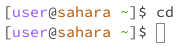
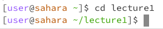
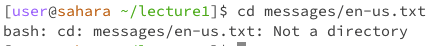
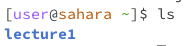
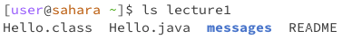
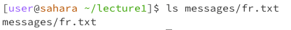

# Lab Report 1

## cd command
**No Arguments**

1. The working directory was `/home`
2. The output was blank, because `cd` is used to change directories. However, if you provide no argument then you are not giving it instructions on where to change to.
3. Not an error

**Path to a directory as an Argument**

1. The working directory was `/home`
2. The prefix changes, because we are using cd to enter the lecture1 folder. Therefore, that is being displayed in the prefix.
3. Not an error

**Path to a file as an Argument**

1. The working directory was `/home/lecture1`
2. The output explains that the given argument should be a path to a directory, rather than a file. Therefore, the task could not be completed.
3. Error. This is an error because when running cd commands, it expects the argument to be a path to a directory, not a file. Therefore, when a path to a file was provided, it explains that the argument is not a directory.

## ls command
**No Arguments**

1. The working directory was `/home`
2. The output shows the files that are in the current directory. In the current directory, there is only lecture1, therefore lecture1 is displayed. It is in blue, because it is either a directroy or a folder.
3. No error.

**Path to a directory as an Argument**

1. The working directory was `/home`
2. The output shows all of the files that are in lecture1. Messages is listed in blue, because it is a folder, whereas the others are not.
3. No error.

**Path to a file as an Argument**

1. The working directory was `/home/lecture1`
2. The output shows the files that are present within messages/fr.txt. Since messages/fr.txt is the only thing, this is all that is returned in the output.
3. No error.

## cat command
**No Arguments**

1. The working directory was `/home`
2. Since there are no arguments provided, the terminal defaulted to reading the input provided from the keyboard. For this reason, whatever is typed out is repeated back to you.
3. No error.

