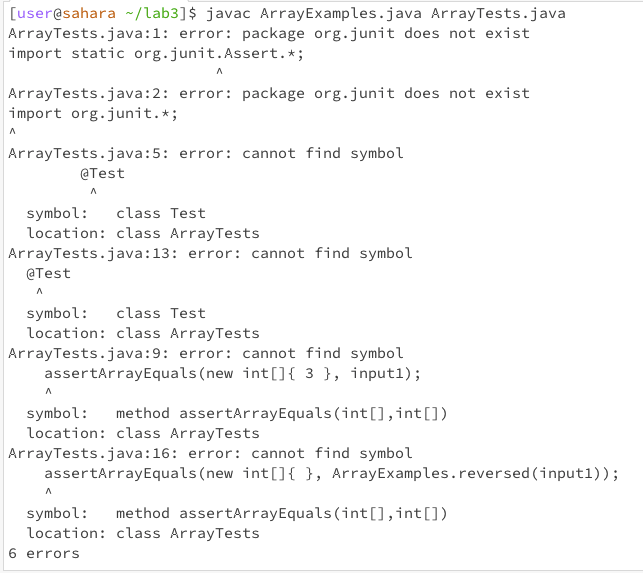

## Lab Report 3

# Part 1

chose: `reversed(int[] arr)` method

**Failure-Inducing Input for Buggy Program**
```
@Test
public void testReversed() {
  int[] input1 = {2, 4};
  assertArrayEquals(new int[]{4, 2}, ArrayExamples.reversed(input1));
```
**Non-Failure-Inducing Input for Buggy Program**
```
@Test
public void testReversed1() {
  int[] input2 = { };
  assertArrayEquals(new int[]{ }, ArrayExamples.reversed(input2));
```

**Symptoms**



**Before and After Code**

*Before*
```
static int[] reversed(int[] arr) {
    int[] newArray = new int[arr.length];
    for(int i = 0; i < arr.length; i += 1) {
      arr[i] = newArray[arr.length - i - 1];
    }
    return arr;
  }
```

*After*
```
static int[] reversed(int[] arr) {
    int[] newArray = new int[arr.length];
    for(int i = 0; i < arr.length; i += 1) {
        newArray[i] = arr[arr.length - i - 1];
    }
    return newArray;
}
```

The error was that elements were being assigned from the NewArray to the original arr, instead of the other way around. Therefore, this would produce the wrong output. However, now that the last two lines have been altered, it now correctly assigns the numbers in the array to produce the desired output.

# Part 2

**Command chosen: grep**

**Command-Line Option #1: `-r`**

Source: https://alvinalexander.com/linux-unix/recursive-grep-r-searching-egrep-find/

*Example 1*
```
Rohans-MacBook-Pro-3:docsearch-1 rohannigam$ grep -r "balloon" technical/biomed
technical/biomed/cc2172.txt:          of 2.5 ml isotonic saline into the semipermeable balloon
technical/biomed/1472-6793-1-12.txt:          A rubber latex balloon on the end of a plastic cannula,
technical/biomed/cvm-2-6-286.txt:        balloon inflation or stent deployment may obstruct large,
technical/biomed/cvm-2-6-286.txt:        low-pressure distal occlusion balloon incorporated into the
technical/biomed/cvm-2-6-286.txt:        of the occlusion balloon in the treated vessel. An
technical/biomed/cvm-2-6-286.txt:        treated vessel before the balloon is deflated and antegrade
technical/biomed/cvm-2-6-286.txt:          advantage of filter devices. In contrast, the balloon
technical/biomed/cvm-2-6-286.txt:          analysis of debris retrieved by the balloon occlusion
technical/biomed/cvm-2-6-286.txt:          retracted into any standard angioplasty balloon. A
technical/biomed/cvm-2-6-286.txt:        catheter with an occlusion balloon attached at its distal
technical/biomed/cvm-2-6-286.txt:        balloon occlusion and establishes retrograde flow in the
technical/biomed/1471-2121-2-1.txt:          wall following balloon catheter injury [ 45]. Since no
```
This option allows for recursively searching files in all subdirectories, and searching for them using the given string or pattern. It has a very common use, that can be used by many people. It searches for the location of "balloon" in all subdirectories provided.

*Example 2*
```
Rohans-MacBook-Pro-3:docsearch-1 rohannigam$ grep -r "jacket" technical/biomed
technical/biomed/1475-925X-2-11.txt:          patient carries a mobile phone in his jacket. At each
technical/biomed/1472-6793-1-12.txt:          jacketed chamber, which was sealed at the top. Myocardial
```

This option allows for recursively searching files in all subdirectories, and searching for them using the given string or pattern. It has a very common use, that can be used by many people. It searches for the location of "jacket" in all subdirectories provided.

**Command-Line Option #2: `-c`**

Source: https://www.geeksforgeeks.org/grep-command-in-unixlinux/

*Example 1*
```
Rohans-MacBook-Pro-3:docsearch-1 rohannigam$ grep -c "genome" technical/biomed/1476-4598-1-6.txt
7
```

This option displays the count of the number of lines that match the given string. By giving just the number of lines, it could help streamline certain processes, such as finding the number of lines that contain a specific string. It finds the number of lines that contain the word "genome" in the provided file.

*Example 2*
```
Rohans-MacBook-Pro-3:docsearch-1 rohannigam$ grep -c "patients" technical/biomed/1472-684X-1-5.txt
38
```

This option displays the count of the number of lines that match the given string. By giving just the number of lines, it could help streamline certain processes, such as finding the number of lines that contain a specific string. It finds the number of lines that contain the word "patients" in the provided file.

**Command-Line Option #3: `-l`**

Source: https://www.geeksforgeeks.org/grep-command-in-unixlinux/

*Example 1*

```
Rohans-MacBook-Pro-3:docsearch-1 rohannigam$ grep -l "nighttime" technical/biomed/*.txt
technical/biomed/1471-213X-1-9.txt
technical/biomed/1471-2431-3-5.txt
technical/biomed/1472-6793-2-18.txt
technical/biomed/1475-2832-1-1.txt
```

This option displays a list of files that contain the string in the command. This is helpful in the case the user wants to know which files contain a keyword or phrase they want to filter by. This creates a smaller list to choose from. In the example above, it filters by the phrase "nighttime".

*Example 2*

```
Rohans-MacBook-Pro-3:docsearch-1 rohannigam$ grep -l "sleep" technical/biomed/*.txt
technical/biomed/1471-2202-3-20.txt
technical/biomed/1471-2210-3-3.txt
technical/biomed/1471-2377-3-4.txt
technical/biomed/1471-2431-2-11.txt
technical/biomed/1471-244X-2-9.txt
technical/biomed/1471-244X-3-5.txt
technical/biomed/1471-2458-2-6.txt
technical/biomed/1472-6793-2-18.txt
technical/biomed/1472-6815-2-3.txt
technical/biomed/1472-684X-2-2.txt
technical/biomed/1472-6882-1-7.txt
technical/biomed/1475-2875-1-14.txt
technical/biomed/1475-925X-2-1.txt
technical/biomed/1477-7525-1-9.txt
technical/biomed/1477-7827-1-43.txt
technical/biomed/cc1476.txt
technical/biomed/cc3.txt
technical/biomed/cc303.txt
technical/biomed/cc991.txt
```
This option displays a list of files that contain the string in the command. This is helpful in the case the user wants to know which files contain a keyword or phrase they want to filter by. This creates a smaller list to choose from. In the example above, it filters by the phrase "sleep".

**Command-Line Option #4: `-w`**

Source: https://www.geeksforgeeks.org/grep-command-in-unixlinux/

*Example 1*

```
Rohans-MacBook-Pro-3:docsearch-1 rohannigam$ grep -w "for" technical/government/media/5_Legal_Groups.txt 
Legal Center at 205 N. 400 West is a project of "And Justice for
services. "And Justice for All," which solicits donations primarily
a problem for staff as well as clients. Owning and sharing the
efficient for those needing legal services. No longer will a woman
desperate for a protective order, for example, have to run all over
Sweet Candy Company building for Tomax. The Olafsons are delighted
```
This option is used to match the whole word. For example, when the string "for" is given, it will only return instances of "for", and not of it being in a bigger word, such as "forever". This makes it more specific and allows the user to find exactly what they are looking for.

*Example 2*

```
Rohans-MacBook-Pro-3:docsearch-1 rohannigam$ grep -w "by" technical/plos/journal.pbio.0020010.txt 
        volumes. The idea was that libraries could save space by removing volumes available in
        funding to launch any such initiative has to be accompanied by a sound business plan to
        by my institution, University College London, in joining JSTOR before the JISC deal was
        has been achieved since 1993, what promise is held out by the next ten years'!
```
This option is used to match the whole word. For example, when the string "by" is given, it will only return instances of "by", and not of it being in a bigger word, such as "bye". This makes it more specific and allows the user to find exactly what they are looking for.
