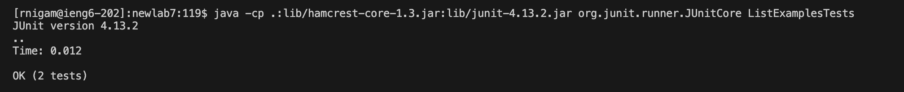

## Lab Report 4

# Part 4

I logged into my ieng6 account, using `<up><up><up><enter>`, since it was 3 commands up

# Part 5

I used `git clone <ctrl v> newlab7 <enter> ` with the link that I copied from my Github account. I typed `newlab7` since lab7 was already in use, so this was an alternative approach. I then did `cd n<tab>` to enter newlab7

# Part 6

I used `<up><up><up><up><up><enter>` to access `javac -cp .:lib/hamcrest-core-1.3.jar:lib/junit-4.13.2.jar *.java` and `<up><up><up><up><up><enter>` again to access `java -cp .:lib/hamcrest-core-1.3.jar:lib/junit-4.13.2.jar org.junit.runner.JUnitCore ListExamples.java`

# Part 7
I typed `vim` and `<shift>l` to access `vim ListExamples.java`. To fix the error in the file `ListExamples` I hit `i` to enter insert mode and `<down>` 43 times and `<e><right><delete><2><esc>` Then after, I used `<shift>;` and `wq` and then hit `<enter>`

# Part 8

I used `<up><up><up>` to reaccess `javac -cp .:lib/hamcrest-core-1.3.jar:lib/junit-4.13.2.jar *.java` and `<up><up><up>` to access `java -cp .:lib/hamcrest-core-1.3.jar:lib/junit-4.13.2.jar org.junit.runner.JUnitCore ListExamples.java` and changd it to `java -cp .:lib/hamcrest-core-1.3.jar:lib/junit-4.13.2.jar org.junit.runner.JUnitCore ListExamplesTests`

# Part 9

Finally, to add and commit, I typed `git st<tab>` to get the status. Following this, I typed `git a<tab> ListExamples<tab>`. Then after adding, I used the commit function, by typing `git co<tab> -m "edited ListExamples.java"`. Lastly, I did `git push`

