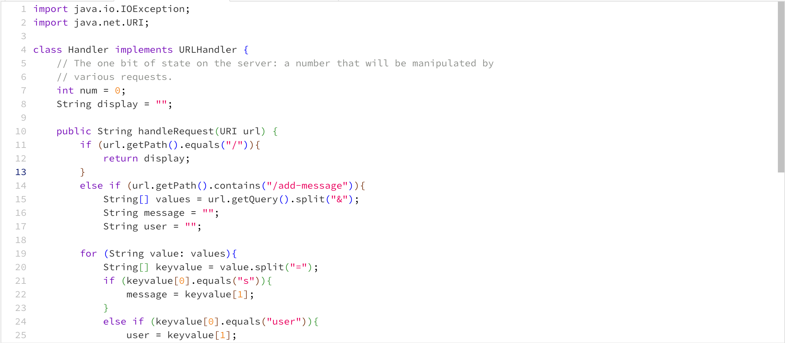
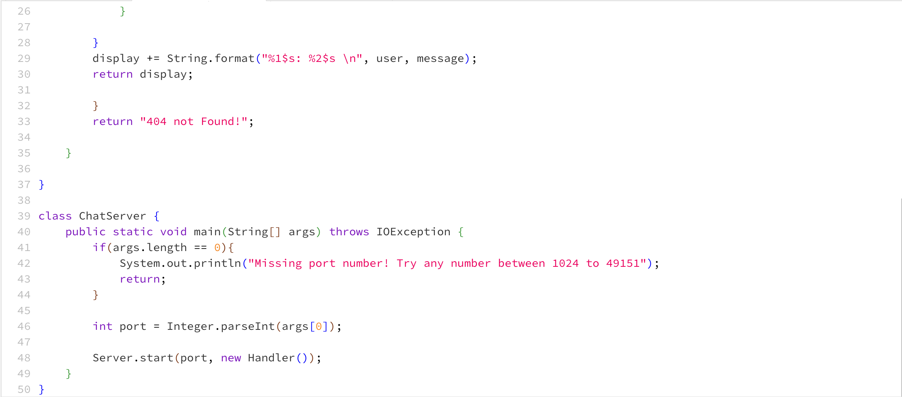
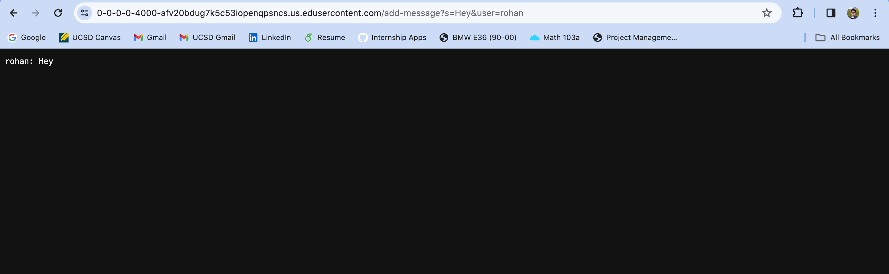
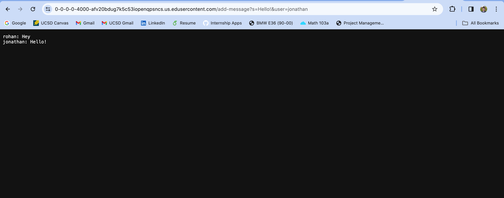
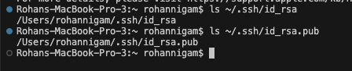

## Lab Report 2
# Part 1

**Screenshot of ChatServer Code**

**Screenshots of /add-message**

The 'public String handleRequest(URI url) method from the Handler class is being used. The argument for this method is the string url request and it determines what is displayed by the web server. A relevant field that is changed is the return message. The return message changes because the input is added to this String, and the previous return message was just an empty string.

Again, the 'public String handleRequest(URI url) method from the Handler class is being used. The argument for this method is the string url request and it determines what is displayed by the web server. A relevant field that is changed is the return message. The return message changed because at first it was equivalent to the value from the last screenshot, but now we add the new input as well. Therefore, the return message now holds the old output as well as the new one. 

# Part 2

**Absolute Paths to Public and Private Keys**

**Logging into account without password**

# Part 3

There was a lot that I was able to learn from lab in week 2 and 3. However, what I found the most interesting was the idea of ports. I now understand that ports are used by web servers to communicate with web clients. Earlier, I would always wonder how the two could be connected, and now I understand. Another thing that I learned was that there is a public and a private key for my SSH key for logging into ieng6.
